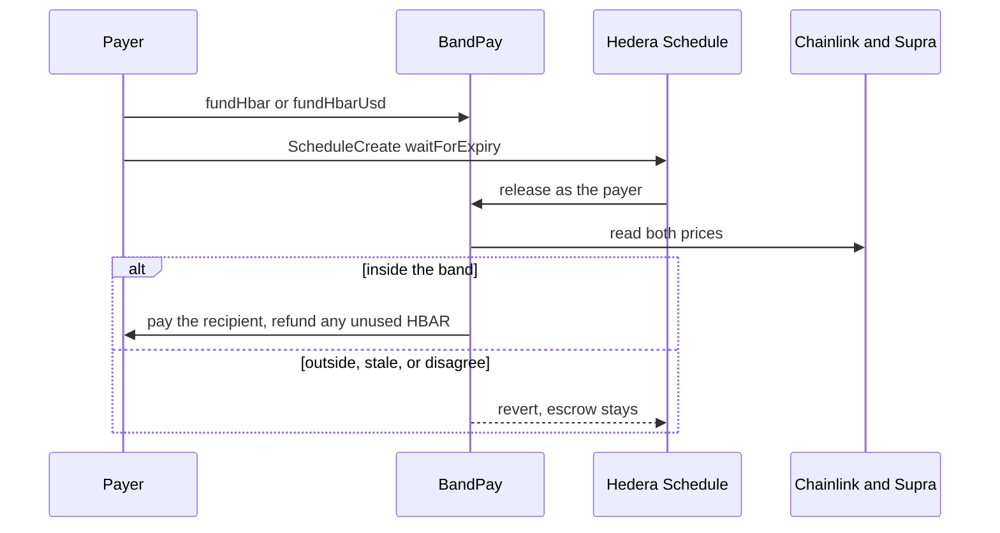

# Bandpay

Schedule one payment. Hedera fires it. It clears only inside your price band.

## Start here

Node 20.18.3 or newer. Git must already have a name and an email. The scaffolder makes the first commit, and it stops if those are empty.

```bash
git config --global user.name "Your Name"
git config --global user.email "you@example.com"
npm create scaffold-hbar@latest -- my-pay --template BikramBiswas786/bandpay
```

That command installs dependencies and selects Hardhat when GitHub returns `template.json`. Do not run `npm install` again. If it asks for Foundry, GitHub did not return the manifest. Run this instead:

```bash
npx create-scaffold-hbar@latest -- my-pay --template BikramBiswas786/bandpay --solidity-framework hardhat --package-manager npm
```

### No key

You can run the tests and open the desk before you create an account. The browser never asks for a private key.

```bash
cd my-pay
npm test
npm run lint
npm run check
npm run dev
```

| Command | What it does | Key |
| --- | --- | --- |
| `npm test` | Compiles the contract and runs the rule, decoder, instalment, and contract tests | No |
| `npm run lint` | ESLint, solhint, and Prettier | No |
| `npm run check` | Reads live Chainlink and Supra and prints what `release` would do | No |
| `npm run dev` | The desk at `http://localhost:3000` | No |

The hosted desk is [bandpay-two.vercel.app](https://bandpay-two.vercel.app). Its Developer Lab shows five outcomes. The fresh-feed row is the live testnet price. The other rows are simulations of the same rule. None of them send a transaction.

### With testnet HBAR

Only this path needs an account. It must be ECDSA, not ED25519, and it must hold HBAR from the [faucet](https://portal.hedera.com/faucet). Do not reuse `0.0.10015230`. The key stays in the shell. The commands are under [One payment, with a key](#one-payment-with-a-key).

## What the template does

There is no bot. You sign one schedule. At expiry Hedera calls `release` once. If the price is outside the band, a feed is stale and the other is missing, or the two feeds disagree by more than 3%, the call reverts and the escrow stays. `cancel` returns it. You can also sign a new schedule for that same plan once the price is back inside the band. `schedule.mjs` will not sign a deadline before `executeAt`.

The price is always HBAR. Chainlink is HBAR/USD. Supra pair 75 is HBAR/USDT, used only as the fallback for that same price. `fundToken` escrows an HTS token, but it does not look up that token's own price. A developer who needs the token's value checked has to add that feed. This template does not.

The evidence, all signed by the exposed account above:

| What it proves | Link |
| --- | --- |
| Hedera executed a scheduled `release` and the plan was paid | [schedule 0.0.10820928](https://hashscan.io/testnet/schedule/0.0.10820928) |
| Hedera fired `release`, `OutsideBand` reverted, and the escrow stayed | [schedule 0.0.10830733](https://hashscan.io/testnet/schedule/0.0.10830733) |
| An HTS token was associated, escrowed, and returned. Not released by a schedule | [contract 0.0.10823213](https://hashscan.io/testnet/contract/0.0.10823213) |

`fundHbarUsd` is the payroll case. The payer escrows HBAR for a dollar invoice. When the schedule fires, `release` uses the checked price, pays that many HBAR, and refunds the rest. If the dollars no longer fit in the escrow, it reverts `Underfunded`. `fundHbarInstallments` splits one escrow into at most 12 plans. `COUNT` and `EVERY_SECONDS` sign one wait-for-expiry schedule per plan. The plan amounts add up to the escrow, and a thirteenth instalment is refused.

`release` is the one-shot. If you schedule `attempt` instead, a refusal is caught, the escrow still stays, and `Attempted` is logged either way, with the revert bytes (`OutsideBand`, `NoPrice`, `Disagree`, `TooEarly`, or `Underfunded`). Hashscan shows that schedule as SUCCESS even when nothing was paid. Read the `Attempted` log. The raw `release` revert, on the old contract, is what a red transaction looks like.

`USD_AMOUNT` on `fund.js` escrows `usdAmount / minPrice` HBAR. Inside the band the price cannot be below `minPrice`, so the invoice cannot ask for more HBAR than the escrow. A token plan is still judged on the HBAR price, and a USD invoice rejects a token on purpose.

A dollar invoice also asks SaucerSwap. `release` calls `getAmountsOut` on the V1 router for WHBAR to USDC. USDC is 6 decimals. If that pool is more than 3% off the oracle, the call reverts `PoolOff` and the escrow stays. Delete the router and a dollar invoice cannot pay: it reverts `NoPool`. An ordinary HBAR band does not ask the pool. That is the difference. The DEX is what makes the invoice safe, not a badge.

The public testnet WHBAR/USDC pair is not a dollar. It has priced HBAR near $2, so the default testnet deploy leaves the router unset rather than paying an invoice against that pool. Mainnet is the public pool. Router `0.0.3045981`, WHBAR `0.0.1456986`, USDC `0.0.456858`, pair `0.0.1462797`. Set `HEDERA_NETWORK=mainnet` and the deploy script uses those. Chainlink and Supra on mainnet still have to be set in the shell. This template does not guess them.

A schedule cannot expire more than 62 days out. `schedule.mjs` refuses a series whose last instalment is past that. Twelve monthly plans cannot all be signed at once.

There is no HCS precompile, so the contract cannot write the topic itself. After the schedule has a mirror result, `node packages/schedule/receipt.mjs` writes `{template, planId, result, scheduleId}` to `BANDPAY_TOPIC_ID`. That message is capped at 1024 bytes.

## How a payment moves

A developer who needs a registry starts at Guardian. This repo is the payment Guardian does not ship.

1. The payer escrows HBAR with `fundHbar`, or an HTS token with `fundToken`. An HTS token must be associated first. `associate` calls precompile `0x167` and accepts only response code 22.
2. `schedule.mjs` signs one `ScheduleCreate` with `waitForExpiry`. It reads the plan first. A deadline before `executeAt` is refused. A price the live feeds already reject is refused unless `ALLOW_REVERT=1`.
3. At expiry, Hedera calls `release` as the payer. There is no keeper.
4. `release` reads Chainlink. If that round is stale it reads Supra. If both are fresh they must agree within 300 bps, and the price must sit inside the band. Otherwise the call reverts and the escrow stays until `cancel`.
5. Only the payer can `cancel`. The escrow comes back.

## Environment

The key stays in the shell. Nothing here is committed.

| Name | When | What |
| --- | --- | --- |
| `DEPLOYER_PRIVATE_KEY` | deploy, fund | ECDSA hex, `0x` plus 64 characters |
| `HEDERA_OPERATOR_ID` | schedule | `0.0.x` |
| `HEDERA_OPERATOR_KEY` | schedule, or fund if the deployer key is unset | same key |
| `BANDPAY_CONTRACT_ID` | fund, schedule, optional check | `0.0.x` from `deploy.js` |
| `PLAN_ID` | schedule | printed by `fund.js` |
| `DUE_IN_SECONDS` | fund, schedule | seconds until `executeAt`, or until the schedule expires |
| `MIN_USD`, `MAX_USD` | fund, optional | narrow the band. Unset means about 0 to 1000 USD |
| `ALLOW_REVERT` | schedule, optional | `1` signs a call the feeds already say will revert |
| `HEDERA_RPC_URL` | optional | defaults to the Hashio URL for `HEDERA_NETWORK` |
| `HEDERA_NETWORK` | optional | `testnet` (default) or `mainnet` |
| `COUNT`, `EVERY_SECONDS` | schedule, optional | sign one schedule per instalment. `COUNT` is 1 to 12 |
| `CHAINLINK_FEED`, `SUPRA_FEED`, `SUPRA_PAIR` | mainnet | required on mainnet. Testnet addresses are already pinned |

## Prerequisites

Node `20.18.3` or newer. An ECDSA testnet account, not an ED25519 key. About 1 HBAR covers a deploy, a few 0.1 HBAR escrows, and the schedule fees. [Faucet](https://portal.hedera.com/faucet). Do not reuse account `0.0.10015230`.

Chainlink's testnet feed is HBAR/USD. Supra pair 75 is HBAR/USDT. They track the same asset closely enough that a 300 bps gap still means one of them is wrong. The contract uses that gap as the disagreement check, not as a FX conversion.

## Architecture



`fundHbar` pays the whole escrow. `fundHbarUsd` pays a USD amount of HBAR at the price `release` just checked, and sends the rest back to the payer. If that USD amount no longer fits in the escrow, `release` reverts `Underfunded`. `fundHbarInstallments` splits one escrow into up to 12 plans. `COUNT` and `EVERY_SECONDS` sign one schedule for each.

`Funded`, `Released`, and `Cancelled` are emitted. Indexers can follow those logs. The desk still reads `plans(id)`, because that is the current state.

## What breaks if you remove it

| Remove | What is left |
| --- | --- |
| The wait-for-expiry schedule | Someone has to send `release` at the right time. That is a keeper. The template no longer has a point. |
| Chainlink and Supra, or `feeds.js` | There is no price. `release` cannot pay, and the page cannot tell you why. |
| The 300 bps check | One bad feed can push a payment through. |
| `associate` before `fundToken` | Hedera rejects the token credit. The HTS path reverts on every fund. |
| The band | A payment would clear at any price. |

## What you copy

The page is the desk. These files are the template:

| File | Why you keep it |
| --- | --- |
| [`packages/hardhat/contracts/BandPay.sol`](packages/hardhat/contracts/BandPay.sol) | Escrow, the band, and the HTS associate call. Deleting the oracle reads makes `release` unable to pay. |
| [`packages/schedule/schedule.mjs`](packages/schedule/schedule.mjs) | One `ScheduleCreate` with `waitForExpiry`. It refuses a deadline before `executeAt`, and it refuses to sign when the live feeds already say `release` would revert, unless `ALLOW_REVERT=1`. |
| [`packages/nextjs/lib/feeds.js`](packages/nextjs/lib/feeds.js) | The two `eth_call`s. Supra's clock is milliseconds. Chainlink's is seconds. Both get scaled to 8 decimals. |
| [`packages/nextjs/lib/plans.js`](packages/nextjs/lib/plans.js) | Decodes `plans(id)` and says whether `release` would pay, revert, or fire too early. |
| [`packages/rules/decide.js`](packages/rules/decide.js) | The same gate as the contract, so you can see a revert before you sign. |
| [`packages/hardhat/scripts/deploy.js`](packages/hardhat/scripts/deploy.js) | Deploys against the public testnet feeds and prints the `0.0.x` id. The key stays in the shell. |
| [`packages/hardhat/scripts/fund.js`](packages/hardhat/scripts/fund.js) | Escrows 0.1 HBAR and prints the plan id. `MIN_USD` and `MAX_USD` narrow the band. Without this, there is nothing for the schedule to release. |

## From a clone

The scaffold command already installed dependencies. Use `npm install` only when you cloned the repo yourself.

Node 20.18.3 or newer. Git needs `user.name` and `user.email` before the first commit.

```bash
npm install
npm test
npm run lint
npm run check
npm run dev
```

`npm test` needs no key and no network. It compiles the contract and runs the price rule, the feed decoder, the plan decoder, the instalment guard, the HCS message guard, the pool quote, and sixteen contract cases. Those cases include `Funded`, `Released`, `Cancelled`, `Attempted`, a USD-sized HBAR payout, and an instalment split.

`npm run lint` is ESLint on the page, solhint on the contracts, and a Prettier check. `npm run format` rewrites the JavaScript. The scaffolder runs that format command after install. The page uses a system font, so `npm run build` does not download a font.

`npm run check` does use the network. It reads Chainlink, Supra, and the escrows already on testnet, and prints what `release` would do right now. No key. Set `BANDPAY_CONTRACT_ID` when you want your own deployment instead of the proof contracts.

`npm run dev` is that same check, in the browser, at `http://localhost:3000`. Connect MetaMask or HashPack on Hedera testnet. **Run pay** sends a release that pays. **Run refuse** and **Run too early** ask the node first and do not broadcast a call that will revert, then a cancel returns the escrow. An EVM wallet cannot create the schedule, so that command stays below. `AMOUNT_HBAR` on `fund.js` defaults to 0.1.

## One payment, with a key

A brand-new account from the [Hedera portal](https://portal.hedera.com) must be ECDSA, on testnet, and hold HBAR. Put the key in the shell only.

```bash
export DEPLOYER_PRIVATE_KEY=0xYOUR_ECDSA_KEY
export HEDERA_OPERATOR_ID=0.0.YOUR_ACCOUNT
export HEDERA_OPERATOR_KEY=$DEPLOYER_PRIVATE_KEY
node packages/hardhat/scripts/deploy.js
```

The last line prints `contractId`. Then escrow 0.1 HBAR. The band is wide on purpose, so a fresh feed can pay. `DUE_IN_SECONDS` is when `release` becomes legal.

```bash
export BANDPAY_CONTRACT_ID=0.0.THE_CONTRACT_ID
export DUE_IN_SECONDS=120
node packages/hardhat/scripts/fund.js
export PLAN_ID=0
export DUE_IN_SECONDS=180
npm run schedule --workspace=@bandpay/schedule
npm run check
```

Leave `MIN_USD` and `MAX_USD` unset for that first payment. The default band is about `0` to `1000` USD, so a fresh feed can pay. Set them when you want the desk to show a refusal:

```bash
export MIN_USD=1
export MAX_USD=2
export DUE_IN_SECONDS=60
node packages/hardhat/scripts/fund.js
```

`fund.js` prints `planId`. The schedule must expire after `executeAt`. If it does not, `schedule.mjs` exits and signs nothing. It also exits when the live feeds say `release` would revert, unless you set `ALLOW_REVERT=1`. That flag is how the outside-band plan was scheduled on purpose: Hedera still calls `release`, the call reverts, and the escrow stays.

## HTS

`fundToken` moves the token with `transferFrom`. On Hedera that facade call reverts until the contract is associated to the token. Call `associate(tokenSolidityAddress)` once. It hits precompile `0x167` and accepts only response code 22. Then `approve` the contract from the treasury account and call `fundToken`. HBAR does not need this step.

## Testnet

These links are the proof that Hedera will fire `release`. Every one of them was signed by `0.0.10015230`. That account's key is public. Do not fund it, do not schedule from it, and do not copy it into a new project. A fresh ECDSA account from the portal replaces this table. The faucet API needs a personal access token, which this repo does not have, so the table has not been re-signed.

The contracts below were deployed before `Funded`, `Released`, and `Cancelled` existed. The source emits those events. A new deploy emits them on chain. A scheduled release of an HTS token has not been shown. What is shown for the token is associate, fund, and cancel.

Testnet feeds, not secrets:

| Feed | Address |
| --- | --- |
| Chainlink HBAR/USD | `0x59bC155EB6c6C415fE43255aF66EcF0523c92B4a` |
| Supra push oracle, pair 75 | `0x6Cd59830AAD978446e6cc7f6cc173aF7656Fb917` |

`BandPay` is deployed against those addresses, pair id `75`, and a max age of `3600` seconds.

The first deployment is the schedule proof. It pays HBAR and does not have `associate`: [0.0.10820921](https://hashscan.io/testnet/contract/0.0.10820921).

| What happened | Proof |
| --- | --- |
| Contract created | [deploy](https://hashscan.io/testnet/transaction/0xd613652f5b29cdcc0c5eaf144956800c7fb7b706cf5927c66ff4e27340f5e002) |
| Payer called `release` while both feeds were fresh and inside the band. 0.1 HBAR was paid. | [release](https://hashscan.io/testnet/transaction/0xbced1142081f0b901f09aa4637dc18a2b298bcef44215eb4e749f183cb51749f) |
| A second 0.1 HBAR was escrowed, then a wait-for-expiry schedule called `release`. Hedera executed it. The plan is paid. | [schedule 0.0.10820928](https://hashscan.io/testnet/schedule/0.0.10820928) · [executed call](https://hashscan.io/testnet/transaction/0.0.10015230-1790921501-362680160) · [mirror](https://testnet.mirrornode.hedera.com/api/v1/schedules/0.0.10820928) |

Two later escrows on that same contract are still open. The desk judges them against the live feeds. Neither has been scheduled.

| What happened | Proof |
| --- | --- |
| Plan 2 escrows 0.1 HBAR inside a wide band. After `executeAt`, `release` would pay. | [fund plan 2](https://hashscan.io/testnet/transaction/0xbc3b5e2db42ff355046452f45edb1377447d23686ae57771d52eeff53676f7bc) |
| Plan 3 escrows 0.1 HBAR inside a 1–2 USD band. Today's price is about 0.10, so `release` would revert and the escrow would stay. | [fund plan 3](https://hashscan.io/testnet/transaction/0x4baaa1c305fa5c5d01e948fe8544288ac337c746148c34de295b77d766199993) |
| Hedera fired that plan anyway (`ALLOW_REVERT=1`). The scheduled call reverted `OutsideBand` at 0.09903519 USD. Plan 3 is still escrowed, not paid. | [schedule 0.0.10830733](https://hashscan.io/testnet/schedule/0.0.10830733) · [executed call](https://hashscan.io/testnet/transaction/0.0.10015230-1790970685-448974693) · [revert](https://testnet.mirrornode.hedera.com/api/v1/contracts/results/0xb052df49203e6a594a9cf3ca095de72c77677b7b57efbdd6fd04d76a9bcae950) |

The current deployment adds `associate`. HTS token [0.0.10823214](https://hashscan.io/testnet/token/0.0.10823214) was associated, escrowed, and returned: [0.0.10823213](https://hashscan.io/testnet/contract/0.0.10823213). It was not released by a schedule.

| What happened | Proof |
| --- | --- |
| Contract created | [deploy](https://hashscan.io/testnet/transaction/0x167275253adeb8e6a3d0b0bef7b4bab2dd176792b2f30fbc91bfd77040dd53ff) |
| `associate` of `BAND` through precompile `0x167` | [associate](https://hashscan.io/testnet/transaction/0xaa56e37772c35c38dbe25cdd59b69bb3643c4e8d112e999c1ba7d3c241dc251a) |
| `fundToken` moved 5 units into the contract | [fund](https://hashscan.io/testnet/transaction/0xd22946f8cda8ba2f88e8fdd23403386b184b89cc8bf1c0578e615ed0c3182b8a) |
| `cancel` sent those 5 units back to the payer | [cancel](https://hashscan.io/testnet/transaction/0x47b23d519e5de3b0b8f391dea8115ac4f9df92fbbf1e2c1cddab057ebafebda2) |
| A schedule called `release` on a token plan | Not on testnet. `release` already sends the token once the plan is funded. This row is the gap. |

To replace the table, deploy with your own ECDSA key, fund one HBAR plan and one token plan, and schedule both. Do not commit the key.

The script sets `waitForExpiry`, so the signed schedule waits until the expiration and then Hedera sends it. The admin key can delete that schedule before then.

## Adapt it

`HEDERA_NETWORK=testnet` is the default. `mainnet` uses Hashio and the mainnet mirror, and it refuses to deploy until you set `CHAINLINK_FEED` and `SUPRA_FEED` yourself. Those addresses are not pinned here, because a wrong feed is worse than no default.

A payroll is `fundHbarUsd` for a dollar amount, or `fundHbarInstallments` plus `COUNT` and `EVERY_SECONDS` for a series. Another Supra pair is `SUPRA_PAIR`. The band unit stays 8-decimal USD.

## Troubleshooting

| What you see | What it means |
| --- | --- |
| The scaffolder asks for Foundry | GitHub did not return `template.json`. Run the command again, or add `--solidity-framework hardhat`. |
| `INSUFFICIENT_PAYER_BALANCE` | The account needs more testnet HBAR. Use the faucet. |
| `INVALID_SIGNATURE` | The key is ED25519, or it is not the key for `HEDERA_OPERATOR_ID`. Use ECDSA. |
| `TooEarly` | The schedule expires before `executeAt`. `schedule.mjs` refuses that unless you ignore the guard. |
| `OutsideBand` | The price is outside the min and max. The escrow stays until `cancel`. |
| `Disagree` | The two feeds differ by more than 300 bps. |
| `NoPrice` | Both feeds are stale or missing. |
| `Underfunded` | A USD payout would take more HBAR than the escrow. Cancel, or fund a larger escrow. |

## License

MIT. See [LICENSE](LICENSE).
