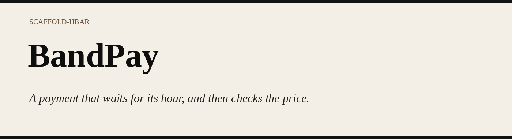
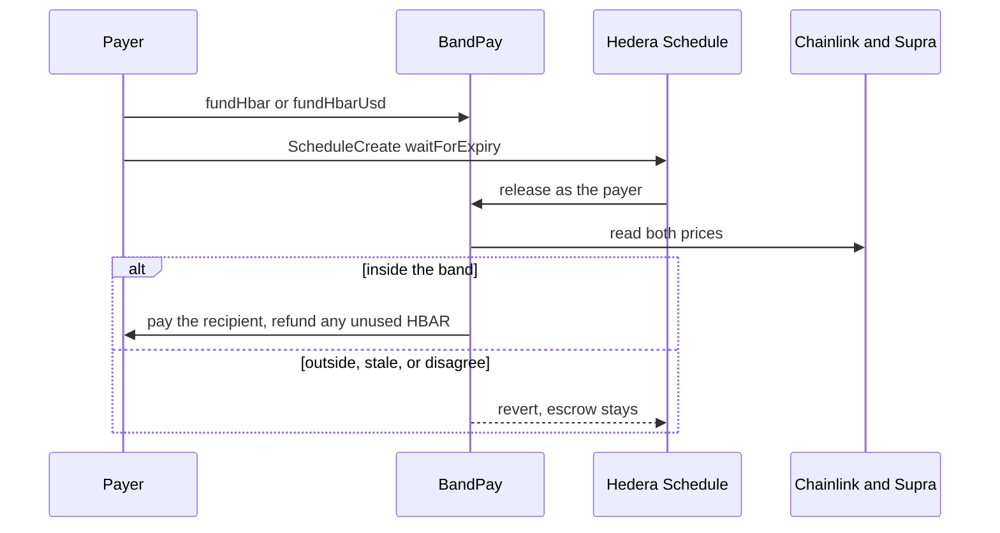

# BandPay

Hedera will schedule a transfer. An oracle page will show you a price. Neither will hold the money and pay it only when two feeds agree. This template does that one thing.

You escrow HBAR, or an HTS token. You sign one schedule. At expiry, Hedera calls `release`. If Chainlink and Supra agree, and the price sits inside your band, the recipient is paid. If they do not, the call reverts and the escrow stays until you cancel it. A dollar invoice also asks SaucerSwap, and reverts `PoolOff` when that pool is more than 3% off the oracle.

## 1. One command

This is the self-check, the same command the other templates publish. Git needs a name and an email, or the scaffolder stops before its first commit. Node 20.18.3 or newer.

```bash
git config --global user.name "Your Name"
git config --global user.email "you@example.com"
npm create scaffold-hbar@latest -- --template BikramBiswas786/bandpay
cd my-hedera-dapp
npm run demo
```

Run the `npm create` line alone. If npm asks `Ok to proceed? (y)`, type `y` and Enter. Do not paste `cd` into that prompt. That answer cancels the install. `npm test` then hits whatever `package.json` is in your home folder (`user@1.0.0`, “no test specified”), not this template.

To name the folder, put it before `--`:

```bash
npm create scaffold-hbar@latest my-pay -- --template BikramBiswas786/bandpay
cd my-pay
npm run demo
```

PowerShell, one line, no prompt:

```powershell
git config --global user.name "Your Name"; git config --global user.email "you@example.com"; $env:npm_config_yes='true'; npm create scaffold-hbar@latest -- my-pay -- --template BikramBiswas786/bandpay --yes; if ($LASTEXITCODE -eq 0) { Set-Location .\my-pay; npm run demo }
```

Checked 3 Oct 2026 from an empty directory. The create command exited 0 and wrote `my-pay`. `npm run demo` then exited 0: one local payment, then `OutsideBand`, `Disagree`, `NoPrice`, `PoolOff`, and `ScheduleFailed` (this chain has no Schedule Service).

Do not run `npm install` again after the scaffolder finishes. If it asks for Foundry, GitHub did not return `template.json`. Run the same command with `--solidity-framework hardhat --package-manager npm`.

## 2. A fresh developer, end to end

Run these inside `my-pay`. `pwd` (PowerShell: `Get-Location`) must end with that folder. `npm run demo` needs no account and no network. It pays 0.1 HBAR, then shows `OutsideBand`, `Disagree`, `NoPrice`, and `PoolOff`. The escrow stays. After `OutsideBand`, the demo also cancels, and the payer is repaid. `ScheduleFailed` is the laptop: it has no Schedule Service. On testnet, Hedera fires the call.

```bash
npm test
npm run lint
npm run check
npm run dev
```

| Command | What it does | Key |
| --- | --- | --- |
| `npm run demo` | Pays one local escrow, then shows the four reverts and the missing schedule service | No |
| `npm test` | Compiles the contract and runs the rule, decoder, instalment, and contract tests | No |
| `npm run lint` | ESLint, solhint, and Prettier | No |
| `npm run check` | Reads live Chainlink and Supra and prints what `release` would do | No |
| `npm run dev` | The desk at `http://localhost:3000` | No |

The hosted desk is [bandpay-two.vercel.app](https://bandpay-two.vercel.app). It opens on the five outcomes Hedera already ran. No wallet. The Lab tab is the rule. Its fresh-feed row is the live testnet price. The other rows are simulations. None of them send a transaction.

A testnet payment needs an ECDSA account with HBAR from the [faucet](https://portal.hedera.com/faucet). Do not reuse `0.0.10015230`. The key stays in the shell. The commands are under [One payment, with a key](#one-payment-with-a-key).

## 3. The testnet transactions

Five schedules. Each one is Hedera calling `release`.

| What Hedera did | Open it |
| --- | --- |
| Paid the HBAR | [schedule 0.0.10820928](https://hashscan.io/testnet/schedule/0.0.10820928) |
| Reverted `OutsideBand`. The escrow stayed | [schedule 0.0.10830733](https://hashscan.io/testnet/schedule/0.0.10830733) |
| Paid 5 BAND | [schedule 0.0.10831792](https://hashscan.io/testnet/schedule/0.0.10831792) |
| Reverted `PoolOff`. The escrow stayed | [schedule 0.0.10832633](https://hashscan.io/testnet/schedule/0.0.10832633) |
| The contract created the schedule. The payer signed. Hedera paid | [schedule 0.0.10839746](https://hashscan.io/testnet/schedule/0.0.10839746) |

The same five results are on [HCS topic 0.0.10832517](https://hashscan.io/testnet/topic/0.0.10832517). The longer table, with the contract addresses, is under [Testnet](#testnet).

## Video

2:20. Under the five-minute limit. The live desk on Vercel, then one executed schedule on Hashscan, then `npm run demo` in a fresh scaffold. No Hedera account for that command.

On screen: the live HBAR price and the schedules Hedera already ran; [schedule 0.0.10820928](https://hashscan.io/testnet/schedule/0.0.10820928), a transfer Hedera executed; the lab, in order, Chainlink stale, feeds disagree, price outside the band, SaucerSwap off the oracle, and the oracle setting the HBAR; Sign, then the note that an EVM wallet cannot sign the schedule; then `npm run demo`. `ScheduleFailed` in that output is the laptop. This chain has no Schedule Service. On testnet, Hedera fires `release`.

[Watch the walkthrough](docs/demo/BandPay-for-developers.mp4)

21 seconds. That demo command on its own, with the narration for it.

[Watch the run](docs/demo/BandPay-demo.mp4)

## Already available

Use the other tool when it is the job.

| You need | Use |
| --- | --- |
| A transfer, a token, a topic, or a scheduled transfer with no price check | The [Hedera portal](https://portal.hedera.com) and the SDK. No contract. |
| A vault that Hedera ticks, with a pluggable strategy | [`payments-scheduler`](https://github.com/hedera-dev/scaffold-hbar/tree/templates/payments-scheduler). Local tests mock the schedule service. |
| A page that reads Chainlink, Pyth, or Supra | [`oracles`](https://github.com/hedera-dev/scaffold-hbar/tree/templates/oracles). It does not refuse a payment. |
| A payment Hedera fires, that reverts unless two HBAR feeds agree and the price is inside the band | This template. The escrow stays on `OutsideBand`, `Disagree`, `NoPrice`, and `PoolOff`. |

## What the template does

There is no bot. You sign one schedule. At expiry Hedera calls `release` once. If the price is outside the band, a feed is stale and the other is missing, or the two feeds disagree by more than 3%, the call reverts and the escrow stays. `cancel` returns it. You can also sign a new schedule for that same plan once the price is back inside the band. `schedule.mjs` will not sign a deadline before `executeAt`.

The price is always HBAR. Chainlink is HBAR/USD. Supra pair 75 is HBAR/USDT, used only as the fallback for that same price. `fundToken` escrows an HTS token, but it does not look up that token's own price. A developer who needs the token's value checked has to add that feed. This template does not.

The evidence, all signed by the exposed account above:

| What it proves | Link |
| --- | --- |
| Hedera executed a scheduled `release` and the plan was paid | [schedule 0.0.10820928](https://hashscan.io/testnet/schedule/0.0.10820928) · [mirror](https://testnet.mirrornode.hedera.com/api/v1/schedules/0.0.10820928) |
| Hedera fired `release`, `OutsideBand` reverted, and the escrow stayed | [schedule 0.0.10830733](https://hashscan.io/testnet/schedule/0.0.10830733) · [mirror](https://testnet.mirrornode.hedera.com/api/v1/schedules/0.0.10830733) |
| Hedera executed a scheduled release of an HTS token. Plan 1 was paid 5 BAND. This is not an open question. | [schedule 0.0.10831792](https://hashscan.io/testnet/schedule/0.0.10831792) · [mirror](https://testnet.mirrornode.hedera.com/api/v1/schedules/0.0.10831792) |
| A dollar invoice asked SaucerSwap. The public testnet pool was about $2.25 and the oracle was about $0.10, so `PoolOff` reverted and the escrow stayed | [schedule 0.0.10832633](https://hashscan.io/testnet/schedule/0.0.10832633) · [mirror](https://testnet.mirrornode.hedera.com/api/v1/schedules/0.0.10832633) |
| A contract created the schedule through the Schedule Service precompile at `0x16b`. The payer signed. Hedera paid plan 2 | [schedule 0.0.10832843](https://hashscan.io/testnet/schedule/0.0.10832843) · [create](https://hashscan.io/testnet/transaction/0x0587c4431e13e76392f2932c44fa3f177f4b7c01b46ac11c958223b2c75f9fbd) · [executed call](https://hashscan.io/testnet/transaction/0.0.7314364-1790980118-485142054) |
| `BandPay.scheduleRelease` created the schedule. The payer signed. Hedera paid 0.05 HBAR | [contract 0.0.10839717](https://hashscan.io/testnet/contract/0.0.10839717) · [schedule 0.0.10839746](https://hashscan.io/testnet/schedule/0.0.10839746) · [executed call](https://hashscan.io/testnet/transaction/0.0.7314364-1791018681-543656522) |
| Anyone can re-read those results from HCS, with no key | [topic 0.0.10832517](https://hashscan.io/testnet/topic/0.0.10832517) · [mirror](https://testnet.mirrornode.hedera.com/api/v1/topics/0.0.10832517/messages?limit=10&order=asc) |

Re-read from the mirror on 3 Oct 2026. The mirror link on each row is the record. `npm run check` that day printed `pool-off` for the dollar invoice, not `would-pay`.

`fundHbarUsd` is the payroll case. The payer escrows HBAR for a dollar invoice. When the schedule fires, `release` uses the checked price, pays that many HBAR, and refunds the rest. If the dollars no longer fit in the escrow, it reverts `Underfunded`. `fundHbarInstallments` splits one escrow into at most 12 plans. `COUNT` and `EVERY_SECONDS` sign one wait-for-expiry schedule per plan. The plan amounts add up to the escrow, and a thirteenth instalment is refused.

`release` is the one-shot. If you schedule `attempt` instead, a refusal is caught, the escrow still stays, and `Attempted` is logged either way, with the revert bytes (`OutsideBand`, `NoPrice`, `Disagree`, `TooEarly`, or `Underfunded`). Hashscan shows that schedule as SUCCESS even when nothing was paid. Read the `Attempted` log. The raw `release` revert, on the old contract, is what a red transaction looks like.

`USD_AMOUNT` on `fund.js` escrows `usdAmount / minPrice` HBAR. Inside the band the price cannot be below `minPrice`, so the invoice cannot ask for more HBAR than the escrow. A token plan is still judged on the HBAR price, and a USD invoice rejects a token on purpose.

A dollar invoice also asks SaucerSwap. `release` calls `getAmountsOut` on the V1 router for WHBAR to USDC. USDC is 6 decimals. If that pool is more than 3% off the oracle, the call reverts `PoolOff` and the escrow stays. Delete the router and a dollar invoice cannot pay: it reverts `NoPool`. An ordinary HBAR band does not ask the pool. That is the difference. The DEX is what makes the invoice safe, not a badge.

The public testnet WHBAR/USDC pair is not a dollar. On 2 Oct 2026 `getAmountsOut` on router [0.0.19264](https://hashscan.io/testnet/contract/0.0.19264) priced 1 HBAR at about $2.25 while Chainlink was about $0.10. A fresh testnet deploy now sets that router, WHBAR `0.0.15058` and USDC `0.0.5449`. An HBAR band does not ask the pool, so it can still pay. A dollar invoice reverts `PoolOff` instead of paying the $2 pool. That is contract [0.0.10832627](https://hashscan.io/testnet/contract/0.0.10832627): Hedera called `release` on a $0.01 invoice whose band was $0.05–$0.20, the price check passed, and the pool check reverted `PoolOff` at $2.24900458 against $0.10067885. Plan 0 is still escrowed: [schedule 0.0.10832633](https://hashscan.io/testnet/schedule/0.0.10832633) · [revert](https://hashscan.io/testnet/transaction/0x112cebd6698651a83e6668603224d518a12518e3f91d21bb4dcc9fa903a67e1d). Mainnet is the public pool that does track the oracle. On 2 Oct 2026 router [0.0.3045981](https://hashscan.io/mainnet/contract/0.0.3045981) quoted 1 HBAR at $0.100419 and Chainlink was $0.10098840, 56 bps, inside the 3% band. `npm run check` prints today's gap and exits if it would be `PoolOff`. Router `0.0.3045981`, WHBAR `0.0.1456986`, USDC `0.0.456858`, pair `0.0.1462797`. Set `HEDERA_NETWORK=mainnet` and the deploy script uses those. Chainlink and Supra on mainnet still have to be set in the shell. This template does not guess the feed addresses. The pool addresses are pinned.

A schedule cannot expire more than 62 days out. `schedule.mjs` refuses a series whose last instalment is past that. Twelve monthly plans cannot all be signed at once.

There is no HCS precompile, so the contract cannot write the topic itself. After the schedule has a mirror result, `node packages/schedule/receipt.mjs` writes `{template, planId, result, scheduleId}` to `BANDPAY_TOPIC_ID`. That message is capped at 1024 bytes. The proof topic is [0.0.10832517](https://hashscan.io/testnet/topic/0.0.10832517). Message 1 is the HBAR payment, message 2 is the `OutsideBand` revert, message 3 is the HTS payment, message 4 is the `PoolOff` revert, and message 5 is the precompile schedule that paid plan 2 ([submit](https://hashscan.io/testnet/transaction/0.0.10015230-1790980383-654833280)).

## How a payment moves

A developer who needs a registry starts at Guardian. This repo is the payment Guardian does not ship.

1. The payer escrows HBAR with `fundHbar`, or an HTS token with `fundToken`. An HTS token must be associated first. `associate` calls precompile `0x167` and accepts only response code 22.
2. `schedule.mjs` signs one `ScheduleCreate` with `waitForExpiry`. It reads the plan first. A deadline before `executeAt` is refused. A price the live feeds already reject is refused unless `ALLOW_REVERT=1`.
3. At expiry, Hedera calls `release` as the payer. There is no keeper.
4. `release` reads Chainlink. If that round is stale it reads Supra. If both are fresh they must agree within 300 bps, and the price must sit inside the band. Otherwise the call reverts and the escrow stays until `cancel`.
5. Only the payer can `cancel`. The escrow comes back.

## Environment

The key stays in the shell. Nothing here is committed.

| Name | When | What |
| --- | --- | --- |
| `DEPLOYER_PRIVATE_KEY` | deploy, fund | ECDSA hex, `0x` plus 64 characters |
| `HEDERA_OPERATOR_ID` | schedule | `0.0.x` |
| `HEDERA_OPERATOR_KEY` | schedule, or fund if the deployer key is unset | same key |
| `BANDPAY_CONTRACT_ID` | fund, schedule, optional check | `0.0.x` from `deploy.js` |
| `PLAN_ID` | schedule | printed by `fund.js` |
| `DUE_IN_SECONDS` | fund, schedule | seconds until `executeAt`, or until the schedule expires |
| `MIN_USD`, `MAX_USD` | fund, optional | narrow the band. Unset means about 0 to 1000 USD |
| `ALLOW_REVERT` | schedule, optional | `1` signs a call the feeds already say will revert |
| `HEDERA_RPC_URL` | optional | defaults to the Hashio URL for `HEDERA_NETWORK` |
| `HEDERA_NETWORK` | optional | `testnet` (default) or `mainnet` |
| `COUNT`, `EVERY_SECONDS` | schedule, optional | sign one schedule per instalment. `COUNT` is 1 to 12 |
| `CHAINLINK_FEED`, `SUPRA_FEED`, `SUPRA_PAIR` | mainnet | required on mainnet. Testnet addresses are already pinned |

## Prerequisites

Node `20.18.3` or newer. An ECDSA testnet account, not an ED25519 key. About 1 HBAR covers a deploy, a few 0.1 HBAR escrows, and the schedule fees. [Faucet](https://portal.hedera.com/faucet). Do not reuse account `0.0.10015230`.

Chainlink's testnet feed is HBAR/USD. Supra pair 75 is HBAR/USDT. They track the same asset closely enough that a 300 bps gap still means one of them is wrong. The contract uses that gap as the disagreement check, not as a FX conversion.

## Architecture



`fundHbar` pays the whole escrow. `fundHbarUsd` pays a USD amount of HBAR at the price `release` just checked, and sends the rest back to the payer. If that USD amount no longer fits in the escrow, `release` reverts `Underfunded`. `fundHbarInstallments` splits one escrow into up to 12 plans. `COUNT` and `EVERY_SECONDS` sign one schedule for each.

`Funded`, `Released`, and `Cancelled` are emitted. Indexers can follow those logs. The desk still reads `plans(id)`, because that is the current state.

## What breaks if you remove it

| Remove | What is left |
| --- | --- |
| The wait-for-expiry schedule | Someone has to send `release` at the right time. That is a keeper. The template no longer has a point. |
| Chainlink and Supra, or `feeds.js` | There is no price. `release` cannot pay, and the page cannot tell you why. |
| The 300 bps check | One bad feed can push a payment through. |
| `associate` before `fundToken` | Hedera rejects the token credit. The HTS path reverts on every fund. |
| The band | A payment would clear at any price. |

## What you copy

The page is the desk. These files are the template:

| File | Why you keep it |
| --- | --- |
| [`packages/hardhat/contracts/BandPay.sol`](packages/hardhat/contracts/BandPay.sol) | Escrow, the band, and the HTS associate call. Deleting the oracle reads makes `release` unable to pay. |
| [`packages/schedule/schedule.mjs`](packages/schedule/schedule.mjs) | One `ScheduleCreate` with `waitForExpiry`. It refuses a deadline before `executeAt`, and it refuses to sign when the live feeds already say `release` would revert, unless `ALLOW_REVERT=1`. |
| [`packages/nextjs/lib/feeds.js`](packages/nextjs/lib/feeds.js) | The two `eth_call`s. Supra's clock is milliseconds. Chainlink's is seconds. Both get scaled to 8 decimals. |
| [`packages/nextjs/lib/plans.js`](packages/nextjs/lib/plans.js) | Decodes `plans(id)` and says whether `release` would pay, revert, or fire too early. |
| [`packages/rules/decide.js`](packages/rules/decide.js) | The same gate as the contract, so you can see a revert before you sign. |
| [`packages/hardhat/scripts/deploy.js`](packages/hardhat/scripts/deploy.js) | Deploys against the public testnet feeds and prints the `0.0.x` id. The key stays in the shell. |
| [`packages/hardhat/scripts/fund.js`](packages/hardhat/scripts/fund.js) | Escrows 0.1 HBAR and prints the plan id. `MIN_USD` and `MAX_USD` narrow the band. Without this, there is nothing for the schedule to release. |
| [`packages/hardhat/scripts/fund-token.js`](packages/hardhat/scripts/fund-token.js) | Associates the token if needed, approves it with a Hedera allowance, and escrows it. An ERC-20 `approve` on the token facade reverts. |

## From a clone

The scaffold command already installed dependencies. Use `npm install` only when you cloned the repo yourself.

Node 20.18.3 or newer. Git needs `user.name` and `user.email` before the first commit.

```bash
npm install
npm test
npm run lint
npm run check
npm run dev
```

`npm test` needs no key and no network. It compiles the contract and runs the price rule, the feed decoder, the plan decoder, the instalment guard, the HCS message guard, the pool quote, and eighteen contract cases. Those cases include `Funded`, `Released`, `Cancelled`, `Attempted`, a USD-sized HBAR payout, an instalment split, the local refusal when the schedule precompile is missing, and a release sent by the contract itself.

`npm run lint` is ESLint on the page, solhint on the contracts, and a Prettier check. `npm run format` rewrites the JavaScript. The scaffolder runs that format command after install. The page uses a system font, so `npm run build` does not download a font.

`npm run check` does use the network. It reads Chainlink, Supra, and the escrows already on testnet, and prints what `release` would do right now. No key. Set `BANDPAY_CONTRACT_ID` when you want your own deployment instead of the proof contracts.

`npm run dev` is that same check, in the browser, at `http://localhost:3000`. Connect MetaMask or HashPack on Hedera testnet. **Run pay** sends a release that pays. **Run refuse** and **Run too early** ask the node first and do not broadcast a call that will revert, then a cancel returns the escrow. An EVM wallet cannot create the schedule, so that command stays below. `AMOUNT_HBAR` on `fund.js` defaults to 0.1.

## One payment, with a key

A brand-new account from the [Hedera portal](https://portal.hedera.com) must be ECDSA, on testnet, and hold HBAR. Put the key in the shell only.

```bash
export DEPLOYER_PRIVATE_KEY=0xYOUR_ECDSA_KEY
export HEDERA_OPERATOR_ID=0.0.YOUR_ACCOUNT
export HEDERA_OPERATOR_KEY=$DEPLOYER_PRIVATE_KEY
node packages/hardhat/scripts/deploy.js
```

The last line prints `contractId`. Then escrow 0.1 HBAR. The band is wide on purpose, so a fresh feed can pay. `DUE_IN_SECONDS` is when `release` becomes legal.

```bash
export BANDPAY_CONTRACT_ID=0.0.THE_CONTRACT_ID
export DUE_IN_SECONDS=120
node packages/hardhat/scripts/fund.js
export PLAN_ID=0
export DUE_IN_SECONDS=180
npm run schedule --workspace=@bandpay/schedule
npm run check
```

Leave `MIN_USD` and `MAX_USD` unset for that first payment. The default band is about `0` to `1000` USD, so a fresh feed can pay. Set them when you want the desk to show a refusal:

```bash
export MIN_USD=1
export MAX_USD=2
export DUE_IN_SECONDS=60
node packages/hardhat/scripts/fund.js
```

`fund.js` prints `planId`. The schedule must expire after `executeAt`. If it does not, `schedule.mjs` exits and signs nothing. It also exits when the live feeds say `release` would revert, unless you set `ALLOW_REVERT=1`. That flag is how the outside-band plan was scheduled on purpose: Hedera still calls `release`, the call reverts, and the escrow stays.

`npm run check` reads those public contracts. It does not create a new schedule. A new schedule needs your own funded ECDSA account and a wait until expiry.

## Dependency audit

`npm audit` on 3 Oct 2026 reported 51 findings (2 critical, 33 high, 2 moderate, 14 low). On 2 Oct the same tree reported 33. The count rose because the advisory database added findings, not because this template added a dependency. `npm audit fix` without `--force` does not clear them. The fixes npm offers are Next 16.3.8 and Hardhat 3, which are major upgrades. This template does not take those the day before the deadline.

| Finding | Where it sits | Does the deployed desk run it? |
| --- | --- | --- |
| `next@14.2.35`, rated critical. The advisory list includes a Windows image-optimizer RCE, an AVIF image RCE, and several Server Component issues | Production dependency of `packages/nextjs` | The desk does not use `next/image`, AVIF, or React Server Components. Vercel runs Linux. The patched releases are Next 15.5.24 and 16.3.8. |
| `protobufjs`, rated critical for code generation from a crafted schema | Inside `@hashgraph/sdk`, used by `packages/schedule` | No. `/api/desk` reads the mirror with `fetch`. It does not decode protobuf and it does not generate code from a schema. |
| Hardhat, `glob`, `postcss`, `solhint`, `tmp`, `undici`, and the React Native tree inside `@hashgraph/sdk` | Development tools, or a dependency the desk does not import | No. They are not in the Vercel function. |

## HTS

`fundToken` moves the token with `transferFrom`. On Hedera that call reverts until the contract is associated, and an ERC-20 `approve` on the token facade also reverts. `fund-token.js` associates when the mirror does not already show the token, then sends `AccountAllowanceApproveTransaction`, then `fundToken`.

```bash
export HEDERA_OPERATOR_ID=0.0.YOUR_ACCOUNT
export HEDERA_OPERATOR_KEY=$DEPLOYER_PRIVATE_KEY
export BANDPAY_CONTRACT_ID=0.0.THE_CONTRACT_ID
export TOKEN_ID=0.0.YOUR_TOKEN
export DUE_IN_SECONDS=60
node packages/hardhat/scripts/fund-token.js
export PLAN_ID=0
export DUE_IN_SECONDS=120
npm run schedule --workspace=@bandpay/schedule
```

HBAR does not need this step. Use `fund.js` for that.

## Testnet

These links are the proof that Hedera will fire `release`. Every one of them was signed by `0.0.10015230`. Do not reuse that account. Create a new ECDSA account from the portal. The faucet API needs a personal access token, which this repo does not have.

The contracts below were deployed before `Funded`, `Released`, and `Cancelled` existed. The source emits those events. A new deploy emits them on chain. Hedera has executed a scheduled HTS release: schedule [0.0.10831792](https://hashscan.io/testnet/schedule/0.0.10831792) paid plan 1, 5 BAND. Topic [0.0.10832517](https://hashscan.io/testnet/topic/0.0.10832517) repeats that result, the HBAR payment, the `OutsideBand` revert, and the `PoolOff` revert.

Testnet feeds, not secrets:

| Feed | Address |
| --- | --- |
| Chainlink HBAR/USD | `0x59bC155EB6c6C415fE43255aF66EcF0523c92B4a` |
| Supra push oracle, pair 75 | `0x6Cd59830AAD978446e6cc7f6cc173aF7656Fb917` |

`BandPay` is deployed against those addresses, pair id `75`, and a max age of `3600` seconds.

The first deployment is the schedule proof. It pays HBAR and does not have `associate`: [0.0.10820921](https://hashscan.io/testnet/contract/0.0.10820921).

| What happened | Proof |
| --- | --- |
| Contract created | [deploy](https://hashscan.io/testnet/transaction/0xd613652f5b29cdcc0c5eaf144956800c7fb7b706cf5927c66ff4e27340f5e002) |
| Payer called `release` while both feeds were fresh and inside the band. 0.1 HBAR was paid. | [release](https://hashscan.io/testnet/transaction/0xbced1142081f0b901f09aa4637dc18a2b298bcef44215eb4e749f183cb51749f) |
| A second 0.1 HBAR was escrowed, then a wait-for-expiry schedule called `release`. Hedera executed it. The plan is paid. | [schedule 0.0.10820928](https://hashscan.io/testnet/schedule/0.0.10820928) · [executed call](https://hashscan.io/testnet/transaction/0.0.10015230-1790921501-362680160) · [mirror](https://testnet.mirrornode.hedera.com/api/v1/schedules/0.0.10820928) |

Plan 2 on that contract is still an open HBAR escrow. Plan 3 was scheduled on purpose and the call reverted.

| What happened | Proof |
| --- | --- |
| Plan 2 escrows 0.1 HBAR inside a wide band. After `executeAt`, `release` would pay. | [fund plan 2](https://hashscan.io/testnet/transaction/0xbc3b5e2db42ff355046452f45edb1377447d23686ae57771d52eeff53676f7bc) |
| Plan 3 escrows 0.1 HBAR inside a 1–2 USD band. Today's price is about 0.10, so `release` would revert and the escrow would stay. | [fund plan 3](https://hashscan.io/testnet/transaction/0x4baaa1c305fa5c5d01e948fe8544288ac337c746148c34de295b77d766199993) |
| Hedera fired that plan anyway (`ALLOW_REVERT=1`). The scheduled call reverted `OutsideBand` at 0.09903519 USD. Plan 3 is still escrowed, not paid. | [schedule 0.0.10830733](https://hashscan.io/testnet/schedule/0.0.10830733) · [executed call](https://hashscan.io/testnet/transaction/0.0.10015230-1790970685-448974693) · [revert](https://testnet.mirrornode.hedera.com/api/v1/contracts/results/0xb052df49203e6a594a9cf3ca095de72c77677b7b57efbdd6fd04d76a9bcae950) |

The current deployment adds `associate`. HTS token [0.0.10823214](https://hashscan.io/testnet/token/0.0.10823214) was associated, escrowed, returned, and later escrowed again and paid by a schedule: [0.0.10823213](https://hashscan.io/testnet/contract/0.0.10823213).

| What happened | Proof |
| --- | --- |
| Contract created | [deploy](https://hashscan.io/testnet/transaction/0x167275253adeb8e6a3d0b0bef7b4bab2dd176792b2f30fbc91bfd77040dd53ff) |
| `associate` of `BAND` through precompile `0x167` | [associate](https://hashscan.io/testnet/transaction/0xaa56e37772c35c38dbe25cdd59b69bb3643c4e8d112e999c1ba7d3c241dc251a) |
| `fundToken` moved 5 units into the contract | [fund](https://hashscan.io/testnet/transaction/0xd22946f8cda8ba2f88e8fdd23403386b184b89cc8bf1c0578e615ed0c3182b8a) |
| `cancel` sent those 5 units back to the payer | [cancel](https://hashscan.io/testnet/transaction/0x47b23d519e5de3b0b8f391dea8115ac4f9df92fbbf1e2c1cddab057ebafebda2) |
| Plan 1 escrowed 5 BAND inside a wide band | [fund](https://hashscan.io/testnet/transaction/0xfeb0534c8baa281075a65224109dab1871b257e519b1b6b94252b688b3cbadc8) |
| Hedera called `release`. The call succeeded and the 5 BAND were paid. Plan 1 is paid. | [schedule 0.0.10831792](https://hashscan.io/testnet/schedule/0.0.10831792) · [executed call](https://hashscan.io/testnet/transaction/0.0.10015230-1790976251-653175855) · [mirror](https://testnet.mirrornode.hedera.com/api/v1/schedules/0.0.10831792) |
| HCS repeats the HBAR payment, the `OutsideBand` revert, and this HTS payment. | [topic 0.0.10832517](https://hashscan.io/testnet/topic/0.0.10832517) · [create](https://hashscan.io/testnet/transaction/0.0.10015230-1790978491-264583638) · [message 3](https://hashscan.io/testnet/transaction/0.0.10015230-1790978526-853047700) |

To replace the table, deploy with your own ECDSA key, fund one HBAR plan and one token plan, and schedule both. Do not commit the key.

The script sets `waitForExpiry`, so the signed schedule waits until the expiration and then Hedera sends it. The admin key can delete that schedule before then.

## Adapt it

`HEDERA_NETWORK=testnet` is the default. `mainnet` uses Hashio and the mainnet mirror, and it refuses to deploy until you set `CHAINLINK_FEED` and `SUPRA_FEED` yourself. Those addresses are not pinned here, because a wrong feed is worse than no default.

A payroll is `fundHbarUsd` for a dollar amount, or `fundHbarInstallments` plus `COUNT` and `EVERY_SECONDS` for a series. Another Supra pair is `SUPRA_PAIR`. The band unit stays 8-decimal USD.

## Troubleshooting

| What you see | What it means |
| --- | --- |
| `npm error canceled`, then `Missing script: "demo"` or `Error: no test specified` from `user@1.0.0` | npm asked `Ok to proceed? (y)` and the next pasted line was `cd my-pay`. Nothing was installed. The shell is still `C:\Users\USER` |
| The scaffolder asks for Foundry | GitHub did not return `template.json`. Run the command again, or add `--solidity-framework hardhat`. |
| `INSUFFICIENT_PAYER_BALANCE` | The account needs more testnet HBAR. Use the faucet. |
| `INVALID_SIGNATURE` | The key is ED25519, or it is not the key for `HEDERA_OPERATOR_ID`. Use ECDSA. |
| `TooEarly` | The schedule expires before `executeAt`. `schedule.mjs` refuses that unless you ignore the guard. |
| `OutsideBand` | The price is outside the min and max. The escrow stays until `cancel`. |
| `Disagree` | The two feeds differ by more than 300 bps. |
| `NoPrice` | Both feeds are stale or missing. |
| `Underfunded` | A USD payout would take more HBAR than the escrow. Cancel, or fund a larger escrow. |
| `ERC-20 approve` reverts on the token | Use `fund-token.js`. The allowance is a Hedera transaction, not an EVM `approve`. |

## License

MIT. See [LICENSE](LICENSE).
